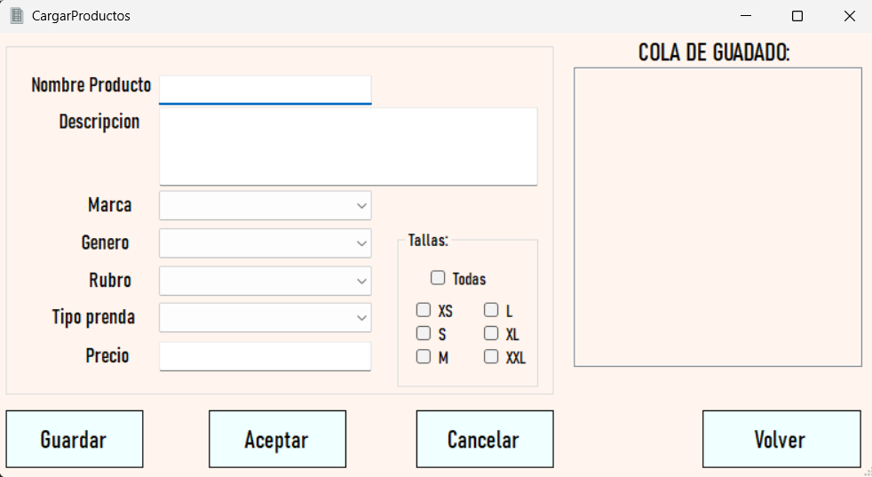

# **Fashion World**

**Fashion World** es un proyecto grupal del primer cuatrimestre de la carrera de la **Tecnicatura Universitaria en Programación**, que tiene como objetivo exponer los conocimientos adquiridos durante los meses de estudio mediante el desarrollo de una aplicación de escritorio (WinForms), utilizando **.NET** y **C#**.

Este proyecto está orientado a la **gestión de inventario** de una empresa de ropa. A través de la aplicación, los usuarios pueden manipular productos y gestionar atributos clave, como las tablas auxiliares, que afectan el funcionamiento del sistema. Además, la aplicación permite consultar y obtener **estadísticas** basadas en los datos almacenados, proporcionando un control detallado de los productos y estadísticas relevantes para la empresa.

---

## **Etapas del Proyecto**

### **1ª Etapa: Diseño de la Base de Datos**

El primer paso consistió en el **desarrollo del diagrama de la base de datos**, definiendo las tablas maestras y auxiliares, las claves, restricciones y las relaciones entre ellas. Esta etapa fue clave para estructurar la base de datos de manera eficiente y asegurar la correcta manipulación de los datos.

### **2ª Etapa: Implementación en SQL Server**

En esta fase, se implementó el diseño de la base de datos en **SQL Server**, creando las tablas a través de **scripts del sistema**. Se utilizaron sentencias de **definición de datos (DDL)** para crear la estructura de la base de datos y se insertaron datos en las tablas. Además, se realizaron **consultas complejas** utilizando sentencias de **manipulación de datos (DML)**, lo que permitió probar el modelo de datos de forma efectiva.

### **3ª Etapa: Diseño de la Interfaz Gráfica**

Finalmente, se diseñó la **interfaz gráfica** utilizando **WinForms de .NET**, con **C#** como lenguaje de programación. El proyecto se estructuró en tres capas principales:

- **Capa de Datos**: Utilizando **ADO.NET**, se realizó la conexión y consultas a la base de datos. En esta capa se implementó el patrón **DAO (Data Access Object)**.
- **Capa de Negocio**: Se definieron las entidades de la base de datos en el código, permitiendo la implementación de la lógica de negocio de la aplicación.
- **Capa de Presentación**: En esta capa se gestionaron las interfaces gráficas, facilitando la interacción del usuario con el sistema.

Esta última etapa permitió aplicar los conocimientos adquiridos sobre **ADO.NET**, la conexión manual a bases de datos (sin el uso de ORMs), la manipulación de componentes en la interfaz gráfica y la implementación del concepto de **ABMC** (Alta, Baja, Modificación y Consulta), lo que permitió interactuar con la base de datos de manera eficiente.

---

## **Funcionalidades Desarrolladas**

Las principales funcionalidades implementadas en la aplicación fueron las siguientes:

- **ABMC de Productos**: Gestión completa de la tabla principal (prendas de ropa/productos), permitiendo realizar **Altas**, **Bajas**, **Modificaciones** y **Consultas**.
- **Filtrado de Productos**: Sistema de filtrado de productos por **marca**, **precio**, **tipo de prenda**, **rubro**, entre otros.
- **Gestión de Tablas Auxiliares**: Agregar nuevos registros a tablas auxiliares como **Rubros**, **Tipos de Prendas** y **Marcas**, permitiendo que estos afecten la gestión de productos.
- **Consultas Avanzadas**: Desarrollo de una sección para mostrar los **resultados de las consultas** realizadas en la segunda etapa del proyecto, proporcionando estadísticas y análisis relevantes para la empresa.

---

## Imágenes de las funcionalidades principales del proyecto :

## Carga de productos

## Ver Detalles de los productos junto con Editar y Borrar

## Carga de datos para tablas auxiliares

## Consultas de la segunda parte del trabajo

